I prepared the implementation plan below and tracked its phases in the session task list. I could not persist `.scratchpad/terraform-resource-implementation-plan.md` because the file-editing tools became unavailable in this turn.

## Implementation Plan: Terraform Resource Implementation for Disposable Azure Test Bench

### Current State

The platform is currently defined by subscription-scope Bicep under `platform/azure/infra/`. It provisions or references:

- Resource groups for network, edge, etcd, OpenBao, applications, Keycloak, and operations.
- VNet `10.60.0.0/16` with dedicated service subnets.
- NAT Gateway and Bastion.
- Private Linux VMs for edge, etcd, OpenBao, applications, and Keycloak.
- System-assigned managed identities.
- Key Vault, OpenBao unseal key, per-secret RBAC, and ACR pull permissions.
- Azure Automation, Hybrid Worker groups/workers, extensions, and runbook resources.
- Private DNS and PostgreSQL private connectivity.
- Optional ACA rollback resources.
- Cloudflare and APISIX runtime behavior documented separately.

The current test bench is disposable. Application data, VM data disks, OpenBao Raft state, and other runtime state may be recreated. Control-plane security and access material remain protected and must not be casually recreated or exposed.

### Target State

Terraform becomes the source of truth for Azure and Cloudflare control-plane resources. Ansible manages VM-local configuration and services. Azure Automation provides approved orchestration, scheduling, locking, and audit.

Provider hierarchy:

1. Azure Verified Modules where an AVM module cleanly matches the desired boundary.
2. AzureRM for direct, stable, or highly specific resources.
3. AzAPI only for demonstrated AzureRM/AVM gaps.
4. Cloudflare provider for Cloudflare control-plane resources.
5. Ansible for packages, Docker, Compose, systemd, APISIX, cloudflared, certificates, and service configuration.

The new environment is created in a distinct test-bench naming boundary rather than imported resource-by-resource. The existing Bicep environment remains available until acceptance completes, then may be destroyed.

### Ownership Boundaries

| Area | Owner |
|---|---|
| Azure resource groups, VNet, subnets, NSGs, NAT, Bastion | Terraform |
| VMs, NICs, managed identities, disks, VM extensions | Terraform |
| Key Vault, private endpoints, private DNS, RBAC | Terraform |
| ACR pull permissions | Terraform |
| Automation Account, workers, extensions, runbooks | Terraform/AzAPI where required |
| Cloudflare Tunnel, Access, Zero Trust, owned DNS | Terraform Cloudflare provider |
| Ubuntu baseline and packages | Ansible |
| Docker, Compose, systemd, file ownership | Ansible |
| APISIX and cloudflared local runtime | Ansible |
| etcd, OpenBao, Keycloak, Registry configuration | Ansible |
| Secret values and runtime seeding | OpenBao/operator workflow; not Terraform state |
| Scheduling, approvals, locks, audits, orchestration | Azure Automation |

### Affected Files

| File | Change Type | Dependencies |
|---|---|---|
| `terraform/env/dev/versions.tf` | Existing | Terraform and provider version decisions |
| `terraform/env/dev/providers.tf` | Existing | AzureRM and AzAPI provider configuration |
| `terraform/env/dev/` | Existing | Thin development root and deployment inputs |
| `terraform/modules/connectivity/` | Existing | Hub, spoke connectivity, Bastion, and capability gates |
| `terraform/modules/network-security/` | Existing | Subnet NSGs, route tables, and associations |
| `terraform/modules/private-vm/` | Existing | Private VM foundation |
| `terraform/modules/managed-identities/` | Existing | Managed identities and opt-in RBAC |
| `terraform/modules/private-dns-zone/` | Existing | PostgreSQL private DNS zone and VNet links |
| `terraform/modules/postgresql/` | Existing | Private PostgreSQL Flexible Server and endpoint |
| `terraform/modules/platform/` | Existing | Top-level platform composition |
| `terraform/modules/platform-services/` | Existing | Ingress/services VNet composition |
| `terraform/modules/application-landing-zone/` | Existing | Application VNet composition |
| `ansible/inventories/` | Create | Terraform outputs |
| `ansible/roles/common/` | Create | New VM baseline |
| `ansible/roles/edge/` | Create | Edge VM and APISIX/cloudflared config |
| `ansible/roles/etcd/` | Create | etcd configuration and certificates |
| `ansible/roles/openbao/` | Create | OpenBao configuration and runtime state |
| `ansible/roles/apps/` | Create | Registry/auth/MCP Compose |
| `ansible/roles/keycloak/` | Create | Keycloak Compose and PostgreSQL settings |
| `ansible/playbooks/bootstrap.yml` | Create | Terraform-created VMs |
| `ansible/playbooks/configure-platform.yml` | Create | Role dependencies |
| `ansible/playbooks/verify-platform.yml` | Create | Health and acceptance checks |
| `platform/azure/README.md` | Modify | Document Terraform/Ansible ownership |
| `.azure/deployment-plan.md` | Modify later | Replace Bicep deployment status with migration status |
| Existing Bicep files | Retain initially | Rollback/reference until Terraform acceptance |

## Execution Plan

### Phase 1: Define Terraform foundation

- Create the Terraform directory structure and provider version constraints.
- Configure the Azure Storage backend with separate state keys for foundation, security, operations, edge, apps, and Keycloak.
- Define subscription, tenant, location, environment, naming, tagging, and administrator-key inputs.
- Establish a new resource naming prefix so the Terraform test bench cannot collide with Bicep resources.
- Define sensitive-variable policy: no passwords, tokens, MongoDB URLs, OpenBao credentials, or secret values in Terraform variables or `.tfvars`.
- Add provider aliases only where separate subscriptions or Cloudflare account boundaries require them.
- Add AVM module versions explicitly where AVM is selected.
- Create a non-secret example variables file.

**Verify:** `terraform fmt -check`, `terraform init`, `terraform validate`, and a plan showing only the new resource boundary.

### Phase 2: Implement networking and access

- Implement resource groups.
- Implement the platform VNet and service subnets:
  - edge;
  - etcd;
  - OpenBao;
  - applications;
  - Keycloak;
  - management;
  - private endpoints;
  - Bastion.
- Implement subnet delegation or service-specific settings where required.
- Implement NSGs with explicit named rules for:
  - edge-to-application HTTP;
  - edge-to-Keycloak HTTP;
  - application-to-OpenBao TLS;
  - edge-to-etcd mTLS;
  - Bastion/management SSH;
  - Keycloak-to-PostgreSQL.
- Implement NAT Gateway and static egress IP.
- Implement Bastion Standard with tunneling enabled and no VM public IPs.
- Implement private DNS zones and VNet links.

**Verify:** Terraform plan has no unintended public VM IPs, subnet overlaps, broad inbound rules, or missing dependencies.

### Phase 3: Implement security and identity

- Create or manage the platform Key Vault with RBAC authorization, soft delete, purge protection, private access, and appropriate network behavior.
- Create the OpenBao unseal key without managing secret values.
- Create system-assigned identities for each VM where required.
- Add per-secret Key Vault role assignments from explicit service-to-secret maps.
- Add ACR `AcrPull` only to the application VM identity.
- Add Automation identity permissions only for the required lock, audit, discovery, and orchestration operations.
- Implement PostgreSQL private endpoint and private DNS if the test bench requires it.
- Keep runtime secret seeding outside Terraform state.

**Verify:** Review the role-assignment plan for exact scopes and reject any whole-vault or subscription-wide permissions not explicitly required.

### Phase 4: Implement compute

- Create a reusable private Linux VM module.
- Pin the Ubuntu 24.04 image version.
- Configure passwordless SSH and system-assigned identity.
- Create NICs with static private addresses.
- Create disposable OS/data disks as appropriate.
- Enable boot diagnostics.
- Avoid using `custom_data` for large mutable service configuration or secrets.
- Create role-specific VM instances:
  - edge;
  - etcd;
  - OpenBao;
  - applications;
  - Keycloak.
- Add VM extensions only for infrastructure-supported functions, not normal application configuration.
- Add `prevent_destroy` selectively to control-plane resources, while allowing disposable data resources to be recreated.

**Verify:** All VMs are private, have the expected subnet/IP, expose no unintended public interface, and produce Terraform outputs suitable for Ansible inventory.

### Phase 5: Implement Automation and Hybrid Workers

- Create the Automation Account.
- Create the Hybrid Worker group.
- Create worker registration resources for the selected VM IDs.
- Install the extension-based Linux Hybrid Worker with the documented resource name, publisher, type, and handler version.
- Use AzAPI only if the required worker child resource is unavailable in AzureRM.
- Create private storage for locks and audit records.
- Create fixed `locks` and `audit` containers.
- Assign the Automation identity only the required blob lease/create/write permissions.
- Publish the read-only runbook only when an immutable artifact URI and version are available.
- Keep mutation jobs disabled until read-only execution is proven.

**Verify:** Worker resources and extensions are created in the correct order; no legacy agent-based worker is deployed; the worker fleet reports heartbeats.

### Phase 6: Define the Terraform-to-Ansible contract

- Export VM IDs, private addresses, role names, resource groups, subnet IDs, Key Vault IDs, ACR login server, and Automation metadata.
- Generate a non-secret Ansible inventory from Terraform outputs or Azure dynamic inventory.
- Define role variables for image digests, hostnames, ports, and service dependencies.
- Keep secret values out of generated inventory.
- Define the role application order:

```text
common
  -> etcd
  -> OpenBao
  -> Keycloak
  -> apps
  -> edge
```

- Use separate Ansible playbooks for bootstrap, configuration, and verification.
- Do not use Terraform provisioners as the normal Ansible bridge.

**Verify:** A newly created VM can be targeted by role without manually editing inventory or exposing credentials.

### Phase 7: Implement Ansible host configuration

- Configure the common Ubuntu baseline.
- Install Docker, Compose, required packages, and monitoring prerequisites.
- Configure restrictive directories and file ownership.
- Render certificates and protected configuration through the approved secret workflow.
- Implement etcd mTLS configuration.
- Implement OpenBao TLS, Raft, auto-unseal configuration, and service lifecycle.
- Implement Keycloak Compose and PostgreSQL connection configuration.
- Implement Registry, auth-server, and MCP gateway Compose configuration with immutable image references.
- Implement APISIX and cloudflared services on the edge VM.
- Use handlers for affected-service restarts only.
- Add health checks after each role.
- Ensure Ansible check mode does not mutate hosts.

**Verify:** Re-running each playbook produces no changes after convergence; secret values never appear in output, diffs, or command arguments.

### Phase 8: Implement Cloudflare and ingress

- Model Cloudflare Tunnel and Zero Trust control-plane resources in Terraform.
- Keep tunnel credentials outside Terraform state where possible.
- Configure cloudflared locally with Ansible using a protected token-file workflow.
- Maintain a single declarative APISIX route model.
- Configure private application and Keycloak origins.
- Preserve public HTTPS metadata:
  - `X-Forwarded-Proto`;
  - `X-Forwarded-Port`;
  - `X-Forwarded-Host`.
- Validate TLS SNI and certificate verification for HTTPS upstreams.
- Keep authentication subrequests bodyless, HTTP/1.1, and header-allowlisted.
- Ensure APISIX Admin API remains private.

**Verify:** Public OIDC discovery, OAuth authorization redirect, callback, session creation, `/api/auth/me`, logout, Registry health, and Keycloak health succeed through the complete edge path.

### Phase 9: Acceptance and teardown

- Apply Terraform into the new disposable resource boundary.
- Run Ansible in check mode and review diffs.
- Converge services in dependency order.
- Run read-only Automation discovery and health jobs.
- Validate:
  - OAuth login and callback;
  - `/api/auth/me`;
  - logout;
  - Registry persistence behavior;
  - MCP gateway routing;
  - OpenBao access;
  - Keycloak issuer and PostgreSQL connectivity;
  - VM restart/recovery;
  - service restart/recovery;
  - edge route recovery;
  - rollback behavior.
- Record the final Terraform and Ansible versions/artifacts.
- Destroy the old Bicep test bench only after the new environment passes acceptance.
- Confirm that destruction removes disposable data but does not remove retained Cloudflare identity, external databases, or operator recovery material unintentionally.

**Verify:** A full destroy/recreate cycle succeeds from the repository without manual Bicep deployment steps.

## Rollback Plan

1. Keep the existing Bicep environment running during Terraform acceptance.
2. Do not change the existing Cloudflare production/test route until the new edge path passes private validation.
3. If Terraform fails, destroy only the new test-bench resource group/state boundary.
4. If Ansible fails, rerun the affected role in check mode, correct the role, and reconverge only that role.
5. If edge routing fails, restore the previous Cloudflare/APISIX route configuration.
6. If a VM becomes unhealthy, recreate the disposable VM and rerun Ansible rather than performing manual state repair.
7. Preserve Terraform state, Cloudflare credentials, Key Vault access policy, certificates, and recovery material independently of disposable VM/data resources.

## Risks

- **AVM abstraction mismatch:** a module may manage more than desired. Mitigate by wrapping only clear module boundaries and using AzureRM directly for exceptions.
- **AzAPI API-version drift:** isolate AzAPI resources and pin/document their API versions.
- **Terraform state exposure:** keep secret values out of state and restrict backend access.
- **Cloudflare/Terraform ownership overlap:** define which tunnel, DNS, and Zero Trust resources are retained versus recreated before applying.
- **Terraform/Ansible overlap:** never manage the same VM-local file or service from both tools.
- **Hybrid Worker ordering:** create the worker group and worker registration before installing the VM extension.
- **Ingress regressions:** test APISIX, cloudflared, SNI, forwarded HTTPS metadata, and OAuth as one end-to-end contract.
- **Disposable-data assumption leakage:** keep database endpoints and credentials externalized even though local platform data may be recreated.
- **Security-boundary recreation:** do not treat identity, RBAC, tunnel credentials, certificates, or recovery material as disposable merely because application data is.

## Definition of Done

- A fresh test bench can be created with Terraform without Bicep.
- AVM is used where it reduces implementation without obscuring ownership.
- AzureRM handles stable direct resources and AzAPI is limited to documented gaps.
- Ansible configures every VM role idempotently and supports check mode.
- Cloudflare control-plane resources and VM-local edge runtime have distinct owners.
- No secrets appear in Terraform state, variables, Ansible inventory, command arguments, or logs.
- Hybrid Workers execute a read-only health job successfully.
- OAuth, Registry, MCP, OpenBao, Keycloak, APISIX, and cloudflared acceptance checks pass.
- Restart/recovery and full destroy/recreate tests pass.
- The old Bicep test bench can be removed without losing retained control-plane assets.

Using `platform/` as the canonical, no-drift reference, the current architecture is:

```mermaid
graph TB
    Internet["Internet / Browser"]
    Cloudflare["Cloudflare Tunnel<br/>mcp-gateway-registry-edge"]
    Edge["vm-edge-platform<br/>private IP from Terraform output<br/>APISIX + cloudflared"]
    Bastion["Azure Bastion Standard<br/>platform dev hub"]
    Apps["vm-application-dev<br/>private IP from Terraform output<br/>Registry + auth-server + MCP gateway"]
    Keycloak["vm-keycloak-dev<br/>private IP from Terraform output<br/>Keycloak"]
    Etcd["vm-etcd-platform<br/>private IP from Terraform output<br/>mTLS etcd"]
    OpenBao["vm-openbao-platform<br/>private IP from Terraform output<br/>OpenBao Raft + TLS"]
    PostgreSQL["Managed PostgreSQL<br/>Keycloak database"]
    MongoDB["External MongoDB<br/>Registry data"]
    ACR["Azure Container Registry<br/>Immutable application images"]
    KeyVault["Platform Key Vault<br/>Secrets + openbao-unseal key"]
    Automation["Azure Automation<br/>platform-workers"]
    Workers["Extension-based Hybrid Workers<br/>Five private VMs"]
    NAT["NAT Gateway<br/>Deterministic outbound access"]
    DNS["Private DNS<br/>Internal platform names"]
    Storage["Operations Storage<br/>locks + audit containers"]
    Registry["Registry container<br/>private application VM"]
    Auth["auth-server container<br/>127.0.0.1:8888"]
    MCP["MCP gateway container<br/>127.0.0.1:8003"]

    Internet -->|"HTTPS"| Cloudflare
    Cloudflare -->|"Tunnel origin"| Edge
    Edge -->|"HTTP private origin<br/>forwarded HTTPS metadata"| Registry
    Edge -->|"HTTP private origin"| Keycloak
    Edge -->|"mTLS client connection"| Etcd

    Apps --> Registry
    Apps --> Auth
    Apps --> MCP
    Registry -->|"OIDC / internal auth"| Keycloak
    Auth -->|"OIDC validation"| Keycloak
    Registry -->|"Registry persistence"| MongoDB
    Keycloak -->|"TLS database connection"| PostgreSQL
    Apps -->|"Pull by digest"| ACR
    Apps -->|"Restricted token"| OpenBao
    OpenBao -->|"Auto-unseal"| KeyVault
    Apps -->|"Per-secret identity access"| KeyVault
    Keycloak -->|"Per-secret identity access"| KeyVault
    Edge -->|"Tunnel/API/cert secrets"| KeyVault
    Etcd -->|"TLS material"| KeyVault

    Apps -->|"Outbound via NAT"| NAT
    Keycloak -->|"Outbound via NAT"| NAT
    Edge -->|"Outbound via NAT"| NAT
    OpenBao -->|"Outbound via NAT"| NAT

    Automation --> Workers
    Workers -->|"Local health/config operations"| Edge
    Workers -->|"Local health/config operations"| Etcd
    Workers -->|"Local health/config operations"| OpenBao
    Workers -->|"Local health/config operations"| Apps
    Workers -->|"Local health/config operations"| Keycloak
    Automation -->|"Durable locks and audit"| Storage

    Bastion -.->|"Private SSH tunnel"| Edge
    Bastion -.->|"Private SSH tunnel"| Apps
    Bastion -.->|"Private SSH tunnel"| Keycloak
    Bastion -.->|"Private SSH tunnel"| OpenBao

    DNS -.-> Edge
    DNS -.-> Apps
    DNS -.-> Keycloak
    DNS -.-> OpenBao

    classDef internet fill:#e0e7ff,stroke:#4338ca,color:#1e1b4b
    classDef edge fill:#dbeafe,stroke:#1f6feb,stroke-width:2px,color:#0b3d91
    classDef compute fill:#dbeafe,stroke:#1f6feb,color:#0b3d91
    classDef data fill:#dcfce7,stroke:#15803d,color:#14532d
    classDef security fill:#fef3c7,stroke:#92400e,stroke-width:2px,color:#78350f
    classDef operations fill:#ede9fe,stroke:#7c3aed,color:#4c1d95
    classDef network fill:#f3f4f6,stroke:#6b7280,color:#1f2937

    class Internet internet
    class Cloudflare,Edge edge
    class Apps,Keycloak,Etcd,OpenBao,Registry,Auth,MCP compute
    class PostgreSQL,MongoDB,ACR,Storage data
    class KeyVault,Bastion security
    class Automation,Workers operations
    class NAT,DNS network
```



## Canonical resource inventory

| Layer | Resources |
|---|---|
| Network | `vnet-platform-hub`, `10.60.0.0/16`, service subnets, private DNS |
| Access | Azure Bastion Standard in the platform hub; no public IPs on service VMs |
| Edge | `vm-edge-platform`, APISIX, Cloudflare Tunnel connector |
| Coordination | `vm-etcd-platform`, private mTLS client endpoint on port `2379` |
| Secrets | `vm-openbao-platform`, single-node Raft, private TLS on port `8200`, Azure Key Vault auto-unseal if configured |
| Application | `vm-application-dev`, Registry/auth-server/MCP gateway Docker Compose stack |
| Identity | `vm-keycloak-dev`, official Keycloak image, managed PostgreSQL backend |
| Azure security | Platform Key Vault, per-secret RBAC, system-assigned VM identities |
| Operations | Boundary/Ansible operations; Azure Automation is not deployed in the current Terraform state |
| Audit/control | Private operations storage with `locks` and `audit` containers |
| External dependencies | MongoDB, PostgreSQL, ACR, embeddings provider, remote MCP services |
| Rollback | Existing ACA capacity retained until final application acceptance |

## Key relationships

| Source | Target | Relationship |
|---|---|---|
| Browser | Cloudflare Tunnel | Public HTTPS ingress |
| Cloudflare Tunnel | Edge VM | Tunnel origin |
| APISIX | Application VM | Private HTTP route to the Terraform-reported application private address |
| APISIX | Keycloak VM | Private HTTP route to the Terraform-reported Keycloak private address |
| APISIX | etcd VM | mTLS configuration/state access |
| Registry/auth-server | Keycloak | OIDC discovery, authorization, token validation |
| Registry | MongoDB | Persistent registry data |
| Keycloak | PostgreSQL | Realm and identity persistence |
| Application VM | ACR | Immutable image pull through managed identity |
| Service VMs | Key Vault | Individually scoped secret and certificate access |
| Registry | OpenBao | Restricted egress secret operations |
| OpenBao | Key Vault | Azure-managed auto-unseal |
| Automation | Hybrid Workers | Approved local VM operations |
| Automation | Operations Storage | Distributed locks and durable audit records |
| Bastion | Private VMs | Break-glass SSH tunneling |
| Private VNet | NAT Gateway | Controlled outbound connectivity |

## Architectural interpretation

The platform has four clear control planes:

1. **Ingress:** Cloudflare Tunnel and APISIX on the edge VM.
2. **Application:** Registry, auth-server, MCP gateway, and Keycloak private VMs.
3. **Platform security/state:** Key Vault, OpenBao, etcd, managed identities, and private DNS.
4. **Operations:** Azure Automation, Hybrid Workers, Bastion, and durable lock/audit storage.

This visualization should be the baseline for the Terraform implementation plan. Terraform should own the Azure and Cloudflare control-plane nodes and relationships; Ansible should own the VM-local services and configuration represented inside the VM nodes.
# Imperative AVM Resources

These resources are mandatory references for this implementation plan and must
be consulted before selecting modules, designing compositions, or writing
Terraform:

- [Terraform Resource Modules | AVM](https://azure.github.io/Azure-Verified-Modules/indexes/terraform/tf-resource-modules/)
- [Terraform Pattern Modules | AVM](https://azure.github.io/Azure-Verified-Modules/indexes/terraform/tf-pattern-modules/)
- [Terraform Utility Modules | AVM](https://azure.github.io/Azure-Verified-Modules/indexes/terraform/tf-utility-modules/)
- [AI-Assisted IaC Solution Development | AVM](https://azure.github.io/Azure-Verified-Modules/experimental/ai-assisted-sol-dev/)
- [Terraform - Solution Development | AVM](https://azure.github.io/Azure-Verified-Modules/usage/solution-development/terraform/)
