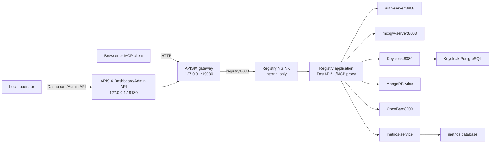

# Current Deployment Runbook

This runbook describes how the current custom Registry, OpenBao, APISIX, and Azure Container Apps changes fit together. It is an as-built operator guide for the present local pilot and independent Registry ACA target, not a specification for the future Zitadel migration or isolated execution service.

## 1. System boundary

The Registry is the control plane and application edge. It owns the web UI, FastAPI API, MCP proxy, A2A discovery, OAuth callback handling, security scanning, health checks, search indexing, and gateway configuration. The Registry does not execute arbitrary third-party MCP package code in the current deployment.

APISIX is the required edge and routing layer. In local development it is loopback-only and backed by etcd. The selected Azure target uses containerized `cloudflared` and APISIX in a private ACA environment, with the option to move both to a dedicated private edge VM later. The Cloudflare account, tunnel, DNS, TLS, WAF, and Access configuration are outside this repository.

OpenBao is a credential store for per-user third-party egress OAuth tokens. It is not the identity provider, the Registry database, or the Azure deployment secret store. The local OpenBao instance is file-backed and intended for development only.

## 2. Request and data flow

### Local Compose topology



Normal user and MCP traffic enters through APISIX and then the Registry NGINX front door. Direct Registry, auth-server, MCP gateway, Keycloak, OpenBao, metrics, Prometheus, Grafana, and APISIX administrative ports are local operator surfaces and must remain private or loopback-bound in local deployments. Prometheus and Grafana are available only through the optional `debug-observability` Compose profile; they are not part of the default or production startup path.

The local APISIX route is a catch-all route with ID `registry`. It forwards to `registry:8080` and applies the existing local `limit-count` policy. APISIX does not replace Registry authentication; the Registry and auth-server continue to enforce application authentication and authorization.

### Azure Container Apps target

```text
Public client
  |
  | Cloudflare DNS, TLS, WAF, Access
  v
Cloudflare Tunnel
  |
  | outbound cloudflared connection
  v
Container App: cloudflared
  |
  | private ACA app-name route
  v
Container App: APISIX
  |-- private ACA app-name routes
  |-- etcd-backed route and Dashboard configuration
  v
Private ACA environment: `cae-mcp-private`
  |-- Container App: mcp-registry
  |-- Container App: auth-server
  |-- Container App: mcpgw-server
  |-- Container App: keycloak
  |-- Container App: etcd
  |
  +--> MongoDB Atlas
  +--> Azure Key Vault through per-app managed identities
  +--> Existing PostgreSQL Flexible Server for Keycloak
```

The ACA environment is internal and uses a dedicated delegated subnet plus NAT Gateway/static egress IP. No Registry, Keycloak, APISIX, or cloudflared application ingress is public; Cloudflare Tunnel is the only browser-facing path. The Bicep entrypoint and modules are in [`../infra/mcp-aca-main.bicep`](../infra/mcp-aca-main.bicep). The Cloudflare tunnel's origin target is APISIX and must be proven with a focused private-routing canary.

The Azure ACA deployment and local Compose edge use the same logical path: cloudflared to APISIX to private application services. The later dedicated edge VM is an infrastructure relocation, not an application redesign. APISIX route configuration remains an explicit deployment artifact and is not inferred from the local Compose state.

### Observability deployment modes

Production telemetry should leave each host through a containerized Grafana Alloy or OpenTelemetry Collector service and be exported over authenticated HTTPS/OTLP to the hosted Grafana service. The collector is a shared policy boundary for batching, retry, sampling, and redaction; application containers should send OTLP to the collector over the private Compose network and should not each carry hosted-Grafana credentials. The collector can tail explicitly mounted application/container log directories and receive APISIX, cloudflared, and host logs through narrowly scoped read-only mounts. Avoid exposing the Docker socket unless a required receiver has no safer alternative.

The local Prometheus and Grafana containers remain useful for troubleshooting and offline development. They are disabled by default so verbose debug telemetry and short-lived investigation data stay on the host:

```bash
# Normal local startup: no local Prometheus or Grafana
docker compose up -d

# Enable the local debugging dashboards when investigating a problem
docker compose --profile debug-observability up -d
```

Keep production telemetry and debug telemetry separate. Always-on production signals include service health, request/error rates, latency, resource saturation, security counters, and durable audit events. Debug mode may enable higher trace sampling and more verbose local logs, but secrets, tokens, claims, credentials, request bodies, tool arguments, and PII must still be redacted. The existing anonymous adoption telemetry settings (`MCP_TELEMETRY_*`) are separate from this operational observability pipeline.

## 3. Repository source of truth

| Concern | Source of truth | Responsibility |
|---|---|---|
| Base local services | [`docker-compose.yml`](../docker-compose.yml) | Build-based Registry, auth, MCP gateway, OpenBao, Keycloak, metrics, and operator services |
| Prebuilt local services | [`docker-compose.prebuilt.yml`](../docker-compose.prebuilt.yml) | Image-based equivalent used by the prebuilt deployment workflow |
| Podman local services | [`docker-compose.podman.yml`](../docker-compose.podman.yml) | Rootless/container-machine port and mount adaptations |
| APISIX overlay | [`docker-compose.edge.yml`](../docker-compose.edge.yml) | etcd, APISIX, route bootstrap, ports, and persistent route volume |
| APISIX runtime configuration | [`docker/apisix/config.yaml`](../docker/apisix/config.yaml) | Traditional mode, embedded Admin API, admin allowlist, and etcd endpoint |
| Initial APISIX route | [`docker/apisix/registry-route.json`](../docker/apisix/registry-route.json) | Registry upstream and local rate limit seed |
| APISIX bootstrap | [`scripts/apisix-local-bootstrap.sh`](../scripts/apisix-local-bootstrap.sh) | Idempotent authenticated route creation |
| OpenBao runtime configuration | [`docker/openbao-local.hcl`](../docker/openbao-local.hcl) | Local UI, listener, and file storage |
| OpenBao initialization | [`scripts/openbao-local-entrypoint.sh`](../scripts/openbao-local-entrypoint.sh) | Initialization, unseal, policy, restricted client token, and persistence |
| Environment contract | [`.env.example`](../.env.example) | Required settings and safe configuration examples |
| Startup orchestration | [`build_and_run.sh`](../build_and_run.sh) | Local preparation, image handling, validation, and Compose startup |
| Azure Registry ACA deployment | [`infra/mcp-aca-main.bicep`](../infra/mcp-aca-main.bicep) | Independent private ACA environment, app identities, private apps, and cloudflared |
| Azure VM fallback record | [`.azure/infrastructure-plan.json`](../.azure/infrastructure-plan.json) | Historical private-edge VM resource graph; not shared with Neo4j or the current ACA target |

## 4. Required configuration

Copy the example file and keep the real file private:

```bash
cp .env.example .env
chmod 600 .env
```

For the current Atlas-backed local deployment, set `STORAGE_BACKEND=mongodb-atlas` and provide the complete `MONGODB_CONNECTION_STRING`. The URI owns TLS, retry, replica-set, and authentication options. Atlas Network Access must allow the deployment's verified egress address.

Set the required application and identity-provider secrets before starting the base stack, including `SECRET_KEY`, Keycloak administrator and database credentials, and the generated Registry/Keycloak client credentials. Follow the [installation guide](installation.md) and [authentication management guide](auth-mgmt.md) for realm and client initialization.

For local APISIX, set `APISIX_ADMIN_KEY` to at least 32 random characters containing only letters, digits, `_`, or `-`. Keep `APISIX_BIND_IP=127.0.0.1` and `APISIX_ADMIN_BIND_IP=127.0.0.1` unless the exposure model has been deliberately redesigned.

For the local no-bypass login flow, set `REGISTRY_URL` and `AUTH_SERVER_EXTERNAL_URL` to `http://127.0.0.1:19080`. Keep `AUTH_SERVER_URL=http://auth-server:8888`; that value is for private container-to-container calls only. Do not point `AUTH_SERVER_EXTERNAL_URL` at port `8888`, because that bypasses APISIX.

When Keycloak is active, keep `KEYCLOAK_URL=http://keycloak:8080` for private service-to-service calls and set `KEYCLOAK_EXTERNAL_URL` to the browser- and federation-visible identity URL. The prebuilt Registry service receives both values so OAuth discovery does not expose the container hostname.

Before enabling federation, replace the local `REGISTRY_URL` and `KEYCLOAK_EXTERNAL_URL` values with stable, externally reachable HTTPS URLs. These URLs must match the Registry Card, OAuth discovery metadata, Keycloak issuer claim, and Keycloak redirect allowlist. Secure deployments reject non-HTTPS remote URLs.

The local OpenBao entrypoint creates its own persistent bootstrap material under `.openbao/`. Do not copy the root token into `.env`, logs, a container argument, or a committed file. Keep `.openbao/` private and back it up only through an approved secrets-handling process.

## 5. Starting the local stack

### Build-based deployment

Use the base file when building the Registry and supporting images locally:

```bash
docker compose -f docker-compose.yml up -d
```

### Prebuilt deployment

Use the short wrapper for the prebuilt workflow:

```bash
./scripts/local-stack.sh start
```

Add the optional local debug dashboards when needed:

```bash
./scripts/local-stack.sh start --debug
```

Stop everything without removing persistent volumes:

```bash
./scripts/local-stack.sh stop
```

Check status:

```bash
./scripts/local-stack.sh status
```

The wrapper encapsulates the Compose layering. For lower-level recovery and layer-specific operations, see the restart procedure below.

### APISIX edge

The edge overlay is required alongside the base file:

```bash
docker compose -f docker-compose.yml -f docker-compose.edge.yml --profile edge up -d
```

The `edge` profile adds three services:

1. `etcd` stores APISIX route and configuration state in the `apisix-etcd-data` volume.
2. `apisix` reads [`docker/apisix/config.yaml`](../docker/apisix/config.yaml), listens on container ports `9080` and `9180`, and publishes only loopback host ports.
3. `apisix-bootstrap` waits for the Admin API and creates the Registry route only when the route ID is absent.

The bootstrap service is intentionally non-destructive. It does not overwrite Dashboard changes when the `registry` route already exists. Deleting the route and restarting the bootstrap service causes the seed route to be recreated.

## 6. Local operator endpoints

| Surface | URL | Purpose |
|---|---|---|
| Registry front door | `http://127.0.0.1:19080` | UI, API, MCP proxy, and auth-routed application traffic through APISIX |
| Registry HTTPS | Not exposed by the local APISIX profile | HTTPS termination remains a Cloudflare/hosted-edge concern |
| APISIX gateway | `http://127.0.0.1:19080` | Required local edge path to the Registry |
| APISIX Dashboard | `http://127.0.0.1:19180/ui/` | Local APISIX operator UI |
| APISIX Admin API | `http://127.0.0.1:19180/apisix/admin/` | Authenticated route and configuration API |
| OpenBao UI | `http://127.0.0.1:8200/ui` | Local vault administration only |
| Prometheus | `http://127.0.0.1:9090` | Local metrics inspection when `debug-observability` is enabled |
| Grafana | `http://127.0.0.1:3000` | Local dashboards when `debug-observability` is enabled |

The APISIX Dashboard is served from the Admin API port because its frontend calls `/apisix/admin` relative to its own origin. Do not access the Dashboard through port `19080`; that port is the data plane and intentionally returns the Registry route response rather than Dashboard assets.

## 7. Verification procedure

Run these checks after a startup or edge change:

```bash
docker compose ps
curl -fsS http://127.0.0.1:19080/health
curl -fsS http://127.0.0.1:19180/ui/
curl -fsS -H "X-API-KEY: ${APISIX_ADMIN_KEY}" \
  http://127.0.0.1:19180/apisix/admin/routes/registry
docker exec mcp-apisix-etcd etcdctl endpoint health
curl -fsS http://127.0.0.1:8200/v1/sys/health
```

The expected APISIX route response contains the `registry` route ID, URI `/*`, upstream `registry:8080`, and the `limit-count` plugin. A wrong or missing Admin API key must return `401`.

The route must use `pass_host: pass` so OAuth callbacks retain the browser-facing host and port. The Registry's OAuth proxy locations likewise preserve the original `Host` header; otherwise a local callback can lose `:19080` and fail.

The Registry Card is reconciled from deployment-controlled metadata when either `/api/card` or `/.well-known/registry-card` is read. This updates the Registry URL, federation endpoint, stable federation API version, organization, and OAuth endpoints without overwriting editable description or contact fields.

Check the effective listeners before treating a local deployment as private:

```bash
ss -lnt | grep -E ':(80|443|19080|19180|8200|8888|8003)\b'
```

Every administrative and direct-service listener should be loopback-bound in the local profile. A `0.0.0.0` binding is an explicit exposure change and requires a corresponding authentication, firewall, and threat-model review.

## 8. Restart, persistence, and recovery

For routine local operation, use the wrapper:

```bash
./scripts/local-stack.sh stop
./scripts/local-stack.sh start
```

Use `./scripts/local-stack.sh start --debug` when local dashboards are required. APISIX and etcd are always part of the local stack. These commands remove containers but preserve volumes. Do not add `-v` during ordinary troubleshooting or shutdown.

For layer-specific recovery, Compose commands must use the same file set that created the services. To stop only the required edge containers while leaving the Registry stack running:

```bash
docker compose -f docker-compose.prebuilt.yml -f docker-compose.edge.yml \
  stop apisix apisix-bootstrap etcd
docker compose -f docker-compose.prebuilt.yml -f docker-compose.edge.yml \
  rm -f apisix apisix-bootstrap etcd

docker compose -f docker-compose.prebuilt.yml \
  stop prometheus grafana
docker compose -f docker-compose.prebuilt.yml \
  rm -f prometheus grafana
```

To stop the complete prebuilt stack with the lower-level command:

```bash
docker compose \
  -f docker-compose.prebuilt.yml \
  -f docker-compose.edge.yml \
  --profile edge \
  --profile debug-observability \
  down --remove-orphans
```

Restart only the layer being changed:

```bash
docker restart mcp-apisix
docker restart mcp-apisix-etcd
docker restart mcp-openbao
```

APISIX routes survive an APISIX restart because etcd data is stored in the named `apisix-etcd-data` volume. OpenBao initialization, unseal material, file data, and the Registry client token survive container recreation because they are stored under `.openbao/`.

Do not use `docker compose down -v` during ordinary troubleshooting. Removing volumes destroys APISIX route state, OpenBao state, monitoring state, and Keycloak PostgreSQL state. If a volume must be removed, first confirm the data is disposable and record the recovery decision.

For OpenBao credential operations and rotation guidance, follow [Per-User Egress Credential Vault](egress-credential-vault.md) and [Rotate MongoDB and OpenBao secrets](faq/rotate-mongodb-and-openbao-secrets.md).

## 9. Troubleshooting

### APISIX will not start

Check that the Admin API key is present, meets the length and character rules, and is supplied to both the APISIX and bootstrap services. If APISIX logs show attempts to reach `127.0.0.1:2379`, inspect [`docker/apisix/config.yaml`](../docker/apisix/config.yaml); the etcd configuration must be under `deployment.etcd`.

### The Dashboard returns 404

Use `http://127.0.0.1:19180/ui/`. Port `19080` is the APISIX data plane and is not the Dashboard origin. If `19180` returns `401` for Admin API calls, supply the configured `X-API-KEY`; the static Dashboard page itself may still be returned before its API requests are authenticated.

### The Registry route is missing

Inspect the bootstrap logs and rerun the one-shot helper without starting unrelated services:

```bash
docker compose -f docker-compose.yml -f docker-compose.edge.yml --profile edge \
  run --rm --no-deps apisix-bootstrap
```

A `404` from the route lookup is the expected signal to create the route. A `401` means the APISIX Admin API key does not match. Do not replace the APISIX image or delete the etcd volume as a first response.

### Keycloak reports `Invalid parameter: redirect_uri`

Keycloak stores the `mcp-gateway-web` redirect allowlist in its persistent realm data. If `AUTH_SERVER_EXTERNAL_URL` changes, add the exact callback URI for the active front door (`http://127.0.0.1:19080/oauth2/callback/keycloak` for the local APISIX profile) to that client. Do not delete the realm or rotate the client secret just to change a redirect URI.

### Atlas connection fails

Confirm the full `MONGODB_CONNECTION_STRING`, the selected MongoDB-family backend, URL encoding of credentials, TLS settings in the URI, and Atlas Network Access for the actual deployment egress address. See [Configuring the MongoDB Atlas backend](faq/configuring-mongodb-atlas-backend.md).

### OpenBao is sealed or the Registry cannot read credentials

Check `docker compose logs openbao`, the health endpoint, and the existence and permissions of `.openbao/bootstrap/` and `.openbao/client/`. The Registry must use the restricted client token mount, not the OpenBao root token. If the bootstrap material is missing while the data store is initialized, stop and recover the approved backup rather than reinitializing the vault.

## 10. Change procedure for the custom edge code

When changing an APISIX route, update [`docker/apisix/registry-route.json`](../docker/apisix/registry-route.json) and keep the route ID stable unless a deliberate migration is required. Update [`scripts/apisix-local-bootstrap.sh`](../scripts/apisix-local-bootstrap.sh) only when readiness, authentication, or idempotency behavior changes.

When changing APISIX listeners or etcd behavior, update [`docker/apisix/config.yaml`](../docker/apisix/config.yaml), [`docker-compose.edge.yml`](../docker-compose.edge.yml), and the matching environment documentation together. Preserve loopback publication and the Admin API allowlist by default.

When changing OpenBao storage or initialization, update the HCL file, entrypoint, Compose mounts, Registry token-file configuration, and [egress vault documentation](egress-credential-vault.md) as one change. Never test credential changes by printing tokens or placing them on a process command line.

After configuration or shell changes, run the smallest applicable checks:

```bash
bash -n scripts/apisix-local-bootstrap.sh
docker compose -f docker-compose.yml -f docker-compose.edge.yml config -q
```

Then repeat the verification procedure and confirm the changed route, listener, or persistence behavior directly.

## 11. Current limits and deferred work

- Cloudflare is not connected by the local Compose profile; the local edge is loopback-only.
- The local APISIX seed route currently covers the Registry only. Additional service routes can be added deliberately without exposing direct application ports.
- Keycloak remains the current identity provider. Zitadel migration is a separate future workstream.
- The Registry scanner is an admission signal, not a runtime sandbox. The isolated MCP/A2A execution service, broker, policy engine, ephemeral runners, and gVisor or microVM boundary are not part of this deployment.
- The Azure gateway is a single-VM pilot boundary, not a high-availability design.
- Local Keycloak uses the development-oriented Compose configuration. Production exposure requires production Keycloak mode, TLS, exact external URL configuration, and independently verified Cloudflare Access controls.

## Related documentation

- [Installation Guide](installation.md)
- [Complete Setup Guide](complete-setup-guide.md)
- [Configuration Reference](configuration.md)
- [Security Posture](security-posture.md)
- [Security Guidelines](SECURITY_GUIDELINES.md)
- [Per-User Egress Credential Vault](egress-credential-vault.md)
- [Configuring the MongoDB Atlas backend](faq/configuring-mongodb-atlas-backend.md)
