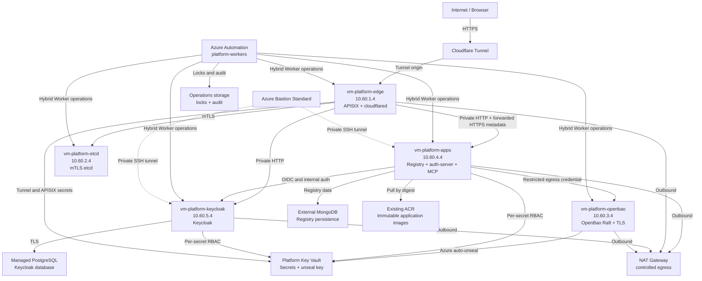

# Terraform Import/Recreate Architecture

**Source:** `platform/` canonical reference  
**Architecture framing:** [Azure landing zones: platform and application landing zones](https://learn.microsoft.com/en-us/azure/cloud-adoption-framework/ready/landing-zone/?tabs=conceptual%2Cplatvsapp)  
**Subscription:** `24595c03-870c-4a3e-93b3-51ec93ec246bf`  
**Region:** `westus3`  
**Environment:** `platform-pilot`  
**Data policy:** Test-bench data is disposable and may be recreated.  
**Drift assumption:** The canonical platform documentation is treated as current with the deployed environment; live Azure discovery is not required for this design pass.

## Overview

The platform is a private Azure VM test bench that models the Cloud Adoption Framework distinction between a shared platform landing zone and application landing zones. The platform landing zone provides shared connectivity and the Cloudflare Tunnel/APISIX ingress boundary. Application landing zones contain workload-specific VNets, resources, and ownership contracts. The application VM runs the Registry, auth-server, and MCP gateway in Docker Compose. Keycloak is isolated on a separate private VM backed by a Terraform-owned managed PostgreSQL service. etcd and OpenBao remain separate private platform services.

For the initial disposable environment, these landing zones are logical
boundaries within one Azure subscription rather than a full management-group
and subscription-vending deployment. The design can later distribute
application landing zones into separate subscriptions without changing the
Cloudflare Tunnel -> APISIX -> private upstream ingress contract.

All externally initiated application traffic must enter through the Cloudflare
Tunnel and APISIX chain. Workload spokes, VMs, private endpoints, and future
application ingress must not expose an alternate public or directly reachable
application path that bypasses this chain.

Azure Bastion provides private operator access without public IPs on service VMs. Azure Automation and extension-based Hybrid Workers provide the controlled operations plane for discovery, health checks, planning, and later approved mutations. Initially, the existing Key Vault is the seeded secret source. Managed identities and narrowly scoped RBAC allow Ansible and approved platform services to retrieve those values without placing them in Terraform configuration, outputs, or state. OpenBao will become the runtime secret source in a later configuration stage; Key Vault remains for bootstrap, unseal, and Azure-native secret use cases where OpenBao is not the appropriate owner.

## Terraform ownership

Terraform should own Azure and Cloudflare control-plane resources:

- Resource groups, VNet, subnets, NSGs, NAT Gateway, Bastion, private DNS, and private endpoints.
- VM identities, NICs, disks, VMs, and VM extensions.
- Key Vault integration, the OpenBao unseal key, managed identities, role assignments, and ACR pull access. Secret values are pre-seeded and consumed through the approved runtime handoff; Terraform does not read or manage their values.
- The Terraform-owned managed PostgreSQL Flexible Server and its private connectivity.
- The external Grafana Cloud observability dependency is referenced by runtime configuration, not provisioned as Azure Managed Grafana.
- Automation Account, Hybrid Worker groups/workers, worker extensions, lock/audit storage, and runbook publication metadata.
- Cloudflare Tunnel, Access, Zero Trust, and explicitly owned DNS resources.

Ansible should own VM-local state:

- Ubuntu packages, Docker, Compose, systemd, file ownership, and local health checks.
- APISIX, cloudflared, etcd, OpenBao, Keycloak, Registry, auth-server, and MCP gateway runtime configuration.
- Protected local files and service restarts.

Secret values, OpenBao tokens, private keys, MongoDB URLs, and application passwords must remain outside Terraform configuration and state. The initial Key Vault seed is a runtime input to Ansible, not a Terraform data flow. The later OpenBao transition changes the runtime source without changing this Terraform boundary.

## Architecture diagram



## Dependency order

```text
resource groups
  -> VNet, subnets, NSGs, NAT, private DNS, Bastion
  -> Key Vault, identities, RBAC, ACR access
  -> VMs and VM extensions
  -> Automation workers and operations storage
  -> Ansible common baseline
  -> etcd
  -> OpenBao
  -> Keycloak
  -> Registry/auth-server/MCP gateway
  -> APISIX and cloudflared routes
```

## AVM selection

| Resource area | Preferred implementation | Reason |
|---|---|---|
| Shared hub connectivity | `Azure/avm-ptn-alz-connectivity-hub-and-spoke-vnet/azurerm` | Owns shared hub capabilities such as hub routing, Bastion, private DNS, and capability-gated egress. |
| Spoke VNets and subnets | `Azure/avm-res-network-virtualnetwork/azurerm` | Each ingress/platform or workload spoke owns its VNet and nested subnets, with explicit peerings to the shared hub; use static CIDRs because AVM IPAM does not support westus3. |
| Linux VMs | `Azure/avm-res-compute-virtualmachine/azurerm` | Module owns VM NICs and extensions through `network_interfaces` and `extensions`. |
| Key Vault and unseal key | `Azure/avm-res-keyvault-vault/azurerm` | Supports vault, keys, private endpoints, RBAC, and network ACLs. |
| Automation Account | `Azure/avm-res-automation-automationaccount/azurerm` | Available AVM module; verify child worker resource coverage. |
| Role assignments | AVM role-assignment module or direct AzureRM | Use the smallest explicit scope and avoid duplicate ownership. |
| Disks | `Azure/avm-res-compute-disk/azurerm` or VM-owned disk inputs | Use VM module ownership where supported; separate disposable data disks only when needed. |
| Hybrid Worker child resources | AzureRM or AzAPI fallback | Select only after inspecting provider/module support. |
| Cloudflare control plane | Cloudflare Terraform provider | Separate from Ansible-managed edge-host services. |

## Recreate-first rules

- Do not write import blocks for disposable resources.
- Use a new naming prefix and separate Terraform state keys.
- Do not preserve OpenBao Raft data or application data.
- Preserve only intentional control-plane assets such as provider credentials, state backend access, and explicitly retained Cloudflare/Key Vault ownership.
- Do not store secret values in Terraform state.
- Do not use Terraform provisioners for routine host configuration.
- Treat Ansible as the sole owner of VM-local runtime files and services.
